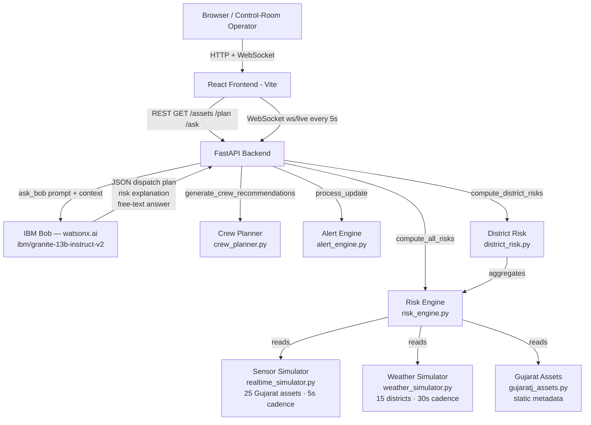

# Architecture

## System Architecture

## Components

| Component | Technology | Responsibility |
|---|---|---|
| Frontend | React 18 + Vite | Live risk map, ranked assets table, dispatch plan view, Ask Bob chat |
| Backend API | FastAPI + uvicorn | REST endpoints, WebSocket push, orchestration |
| IBM Bob / AI | watsonx.ai `ibm/granite-13b-instruct-v2` | Dispatch plan generation, risk explanation, free-text Q&A |
| Risk Engine | Python (`risk_engine.py`) | 6-factor weighted risk scoring per asset, per sensor update |
| Sensor Simulator | Python (`realtime_simulator.py`) | 25 Gujarat assets, correlated anomaly injection, 5s cadence |
| Weather Simulator | Python (`weather_simulator.py`) | 15 districts, storm build-up phases, coastal offsets, 30s cadence |
| Crew Planner | Python (`crew_planner.py`) | Geographic adjacency routing for 6 named crews |
| Alert Engine | Python (`alert_engine.py`) | Threshold-crossing, rapid-increase, anomaly, and weather alerts |

## Data Flow

1. **Sensor simulator** generates correlated readings (temperature, vibration, partial discharge,
   oil quality, load %) for 25 Gujarat grid assets every 5 seconds, injecting realistic
   anomaly signatures (overheating, high vibration, PD spike, overload) on a randomised schedule.

2. **Weather simulator** updates storm probability, wind speed, lightning risk, and rainfall
   for 15 Gujarat districts every 30 seconds, with gradual mode transitions (clear → building → storm → clearing).

3. **Risk engine** (`risk_engine.py`) combines sensor scores, load risk, age/maintenance risk,
   historical failure count, and weather risk into a single `overall_risk_score` (0–100)
   with failure probability and grid impact score per asset.

4. **Alert engine** compares new scores to previous values; fires alerts on threshold crossings
   (60/80), rapid increases (≥15 points), active anomalies, and district-level weather warnings.

5. **WebSocket `/ws/live`** serialises the full payload (assets + risks + alerts + district risks
   + weather) and pushes it to all connected browser clients every 5 seconds.

6. **`/plan` endpoint** calls `compute_all_risks` on demand, ranks assets by grid impact
   (risk 45% × customers 35% × criticality 20%), then sends the top-N assets plus live
   weather to **IBM Bob**, which returns a structured JSON dispatch plan.

7. **IBM Bob** (`ibm/granite-13b-instruct-v2` via watsonx.ai REST) generates:
   - Per-asset: priority rank, concrete action, crew type, dispatch location, ETA, pre-position flag, reason
   - Summary: 2–3 sentence executive operational summary
   - Falls back to a deterministic rule-based local plan when credentials are not set.

8. **Frontend** renders the dispatch plan, live risk map, ranked assets table, alert panel,
   crew pre-positioning recommendations, and the "Ask Bob" free-text chat input.

## Security Considerations

- API keys (`IBM_BOB_API_KEY`, `WATSONX_PROJECT_ID`) are read from environment variables
  via `python-dotenv`; they are never committed to the repository.
- CORS is set to `allow_origins=["*"]` for hackathon convenience; must be tightened before any production deployment.
- No database — no credentials to rotate or data at rest to protect.

## Scalability Notes

The FastAPI backend is stateless and could be horizontally scaled behind a load balancer.
The sensor and weather simulators would be replaced by real SCADA/IoT ingestion (MQTT broker
or REST polling) — the simulator interface (`get_current_readings()`, `get_all_weather()`)
matches what a real data source would provide, so no changes to the risk engine or API layer
are needed for that swap. IBM Bob calls are the latency bottleneck; response caching with a
short TTL (e.g. 60 seconds) would reduce load significantly in production.
