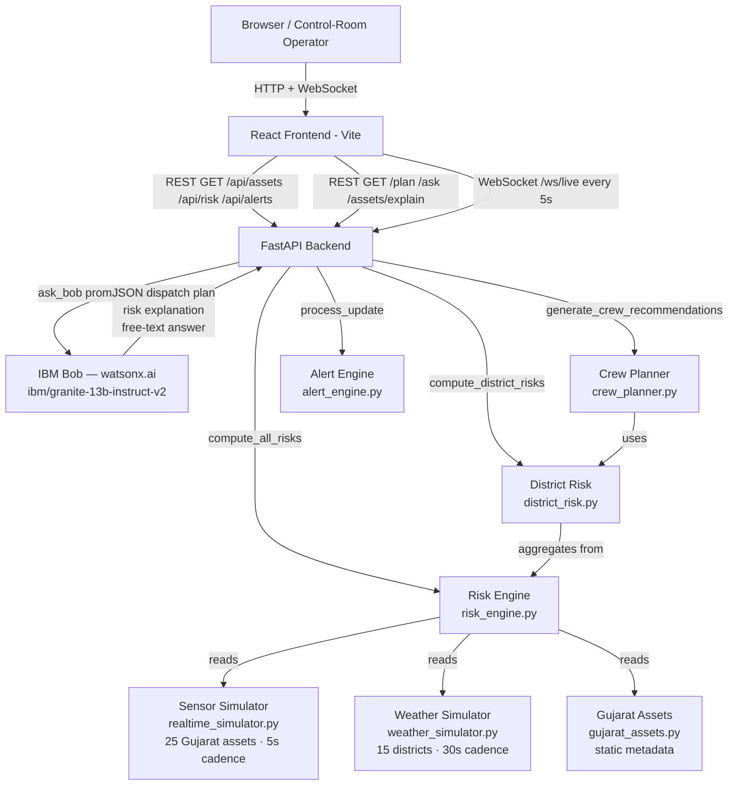

# Architecture

## System Architecture

## Components

| Component | Technology | Responsibility |
|---|---|---|
| Frontend | React 18 + Vite | Live risk map, ranked assets table, dispatch plan view, Ask Bob chat |
| Backend API | FastAPI + uvicorn | REST endpoints, WebSocket push, orchestration |
| IBM Bob / AI | watsonx.ai `ibm/granite-13b-instruct-v2` | Dispatch plan generation, risk explanation, free-text Q&A |
| Risk Engine | Python (`risk_engine.py`) | 5-component weighted risk scoring per asset, per sensor update (sensor, load, age/maintenance, historical, weather) |
| District Risk | Python (`district_risk.py`) | Aggregates per-asset risk scores into district-level outage probability and customer-at-risk summaries |
| Sensor Simulator | Python (`realtime_simulator.py`) | 25 Gujarat assets, correlated anomaly injection, 5s cadence |
| Weather Simulator | Python (`weather_simulator.py`) | 15 districts, storm build-up phases, coastal offsets, 30s cadence |
| Crew Planner | Python (`crew_planner.py`) | Geographic adjacency routing for 6 named crews across Gujarat depots |
| Alert Engine | Python (`alert_engine.py`) | Threshold-crossing, rapid-increase, anomaly, and weather alerts |
| Impact Ranker | Python (`impact_ranking.py`) | Ranks assets by `grid_impact_score` = risk 45% × customers 35% × criticality 20% |

## API Routes

The backend exposes two route groups:

**Real-time `/api/*` routes** (all data sourced from live simulators):

| Method | Path | Description |
|---|---|---|
| WS | `/ws/live` | Full 5s push: assets + risks + alerts + district risks + weather |
| GET | `/api/assets` | All 25 assets with current risk scores and sensor snapshot |
| GET | `/api/assets/{id}` | Single asset with full sensor + risk detail |
| GET | `/api/assets/{id}/history` | Sensor history, last N minutes (default 60, max 120) |
| GET | `/api/risk` | All risk scores sorted by severity descending |
| GET | `/api/risk/{id}` | Single asset risk detail |
| GET | `/api/districts/risk` | All 15 district risk summaries |
| GET | `/api/alerts` | Active alerts, most recent first (last 50) |
| GET | `/api/maintenance/priorities` | Assets ranked by grid impact score |
| GET | `/api/crew/recommendations` | Crew pre-positioning plan |
| GET | `/api/weather` | Current weather snapshot per district |
| GET | `/api/system/health` | System status and data freshness |

**Legacy routes** (kept for compatibility with the Bob integration layer):

| Method | Path | Description |
|---|---|---|
| GET | `/assets` | Impact-ranked asset list |
| GET | `/assets/{id}/explain` | IBM Bob natural-language risk explanation |
| GET | `/plan` | IBM Bob–generated maintenance dispatch plan (`?top_n=` 1–50) |
| POST | `/ask` | Free-text Q&A via IBM Bob |

Swagger UI: `http://localhost:8000/docs`

## Risk Level Thresholds

| Score range | Level | Colour | Default action urgency |
|---|---|---|---|
| 0 – 30 | Low | Green | 720 h (monitor, no action) |
| 31 – 60 | Medium | Yellow | 168 h (next maintenance cycle) |
| 61 – 80 | High | Orange | 48 h (priority inspection) |
| 81 – 100 | Critical | Red | 4 h (emergency dispatch) |

Alert thresholds (from `alert_engine.py`): warning at **60**, critical at **80**, delta alert
at **≥15 points** increase in one 5-second cycle.

## Data Flow

1. **Sensor simulator** generates correlated readings (temperature, vibration, partial discharge,
   oil quality, load %) for 25 Gujarat grid assets every 5 seconds, injecting realistic
   anomaly signatures (overheating, high vibration, PD spike, overload) on a randomised schedule.

2. **Weather simulator** updates storm probability, wind speed, lightning risk, and rainfall
   for 15 Gujarat districts every 30 seconds, with gradual mode transitions
   (clear → building → storm → clearing).

3. **Risk engine** (`risk_engine.py`) combines sensor scores, load risk, age/maintenance risk,
   historical failure count, and weather risk into a single `overall_risk_score` (0–100)
   with failure probability and grid impact score per asset. Weights differ for
   transformer/substation vs. feeder/switchgear/line asset types.

4. **District risk** (`district_risk.py`) aggregates per-asset results into 15 district
   summaries: highest asset risk, count by level, total customers at risk, and district
   outage probability.

5. **Alert engine** compares new scores to previous values; fires alerts on threshold crossings
   (60/80), rapid increases (≥15 points), active anomalies, and district-level weather warnings.

6. **Crew planner** (`crew_planner.py`) assigns the 6 named crews (home depots: Ahmedabad,
   Surat, Rajkot, Vadodara, Bhavnagar, Kutch) to high-risk districts using geographic
   adjacency routing.

7. **WebSocket `/ws/live`** serialises the full payload (assets + risks + alerts + district risks
   + weather) and pushes it to all connected browser clients every 5 seconds.

8. **`/plan` endpoint** calls `compute_all_risks` on demand, ranks assets by grid impact
   (risk 45% × customers 35% × criticality 20%), then sends the top-N assets plus live
   weather to **IBM Bob**, which returns a structured JSON dispatch plan.

9. **IBM Bob** (`ibm/granite-13b-instruct-v2` via watsonx.ai REST) generates:
   - Per-asset: priority rank, concrete action, crew type, dispatch location, ETA, pre-position flag, reason
   - Summary: 2–3 sentence executive operational summary
   - Falls back to a deterministic rule-based local plan when credentials are not set.

10. **Frontend** renders the dispatch plan, live risk map, ranked assets table, alert panel,
    crew pre-positioning recommendations, and the "Ask Bob" free-text chat input.

## Security Considerations

- API keys (`IBM_BOB_API_KEY`, `WATSONX_PROJECT_ID`) are read from environment variables
  via `python-dotenv`; they are never committed to the repository.
- CORS is set to `allow_origins=["*"]` for hackathon convenience; must be tightened before any production deployment.
- No database — no credentials to rotate or data at rest to protect.
- The `.env` file is listed in `.gitignore`; `.env.example` is committed with placeholder values only.

## Scalability Notes

The FastAPI backend is stateless and could be horizontally scaled behind a load balancer.
The sensor and weather simulators would be replaced by real SCADA/IoT ingestion (MQTT broker
or REST polling) — the simulator interface (`get_current_readings()`, `get_all_weather()`)
matches what a real data source would provide, so no changes to the risk engine or API layer
are needed for that swap. IBM Bob calls are the latency bottleneck; response caching with a
short TTL (e.g. 60 seconds) would reduce load significantly in production.
